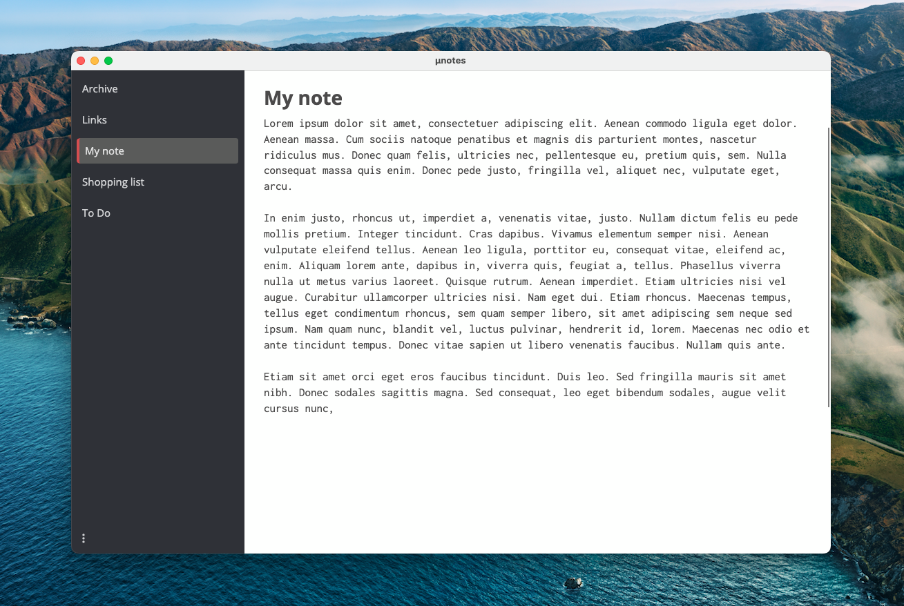

# µnotes
µnotes is a simple plain-text-file based note application for desktop.

## How it works
When starting, µnotes asks to open a folder and lists all .txt files within. You can then edit, rename and delete these files or add new ones.

## Features
µnotes fulfills criteria that are very specific to what I want in a note taking application:

### Plain text file based
No proprietary or obscure file format. This makes sure that your data will outlive this application. If the app is no longer maintained or used, text files can be handled by literally almost every other application.

### Fast and low resource usage
µnotes is developed to use as little resources as possible and have a snappy feel to it. There is **no electron** used here.

### Private
You own your data. µnotes works with local files only. It does not depend on any (cloud) service and works offline first. If you want to sync your notes you are free to use any service you want (a file share, Dropbox, OneDrive, ...). Since it works with plain text files, you could also use GIT as a version control system.

### Minimalist
µnotes contains no bloat. It is simple and has very few features on purpose.

### Cross platform
µnotes was developed using AvaloniaUI and works on Windows, macOS and Linux.

### No installer
µnotes is portable by design so you can use it on your company computer as well.

### Keyboard interface
(This is still a work in progress)

The goal is to develop µnotes in a way that you never have to use a mouse, unless you choose to.

## To Do
- [ ] Better icon
- [ ] Publish a release
- [ ] Styling for text editor search
- [ ] Save all unsaved notes
- [ ] "Delete note" context menu
- [ ] "Search note" feature
- [ ] Hide title bar (https://github.com/AvaloniaUI/Avalonia/issues/9989)

### Maybe
- [ ] Persist last window size + position
- [ ] Persist last splitter position
- [ ] Persist last opened folder
- [ ] Add theming support
- [ ] Setting for font size
- [ ] Setting for line wrap
- [ ] show line wraps
- [ ] show line numbers

### Known issues:
- [ ] macOS crashes when text editor loses focus (fixed by now, update AvaloniaEdit)
- [ ] Closing on macOS either reports a crash or hangs.
- [ ] Message boxes do not get keyboard focus right away.
- [ ] Saving via shortcut moves the caret to the top of the file (at least on windows)
